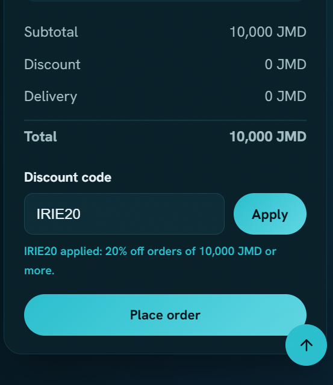

# BUG-001 · Bug Report

## IRIE20 discount does not apply when cart total is exactly 10,000 JMD

**Severity:** Major  ·  **Priority:** P2: High
**Reproducibility:** Always
**Component:** cart
**Environment:** Chrome Version 151.0.7922.71 · Windows 11 · /practice/tumble-kitchen/

### Preconditions
Logged in as a standard user with an existing cart totaling 10,000 JMD

### Steps to reproduce
1. Enter IRIE20 in discount code field
2. Click Apply

### Expected result
Discount should show a 2,000 JMD discount

### Actual result
Discount shows 0 JMD

### Evidence

### Regression
New issue / new feature

### Workaround
Works at 10,001+ JMD

### User impact
Affects all users with cart equaling exactly 10,000 JMD

---

## Summary
This bug report details an issue where the IRIE20 discount is not applied when the cart total is exactly 10,000 JMD. The discount should provide a 2,000 JMD reduction, but instead shows 0 JMD. This affects all users with carts totaling exactly 10,000 JMD.