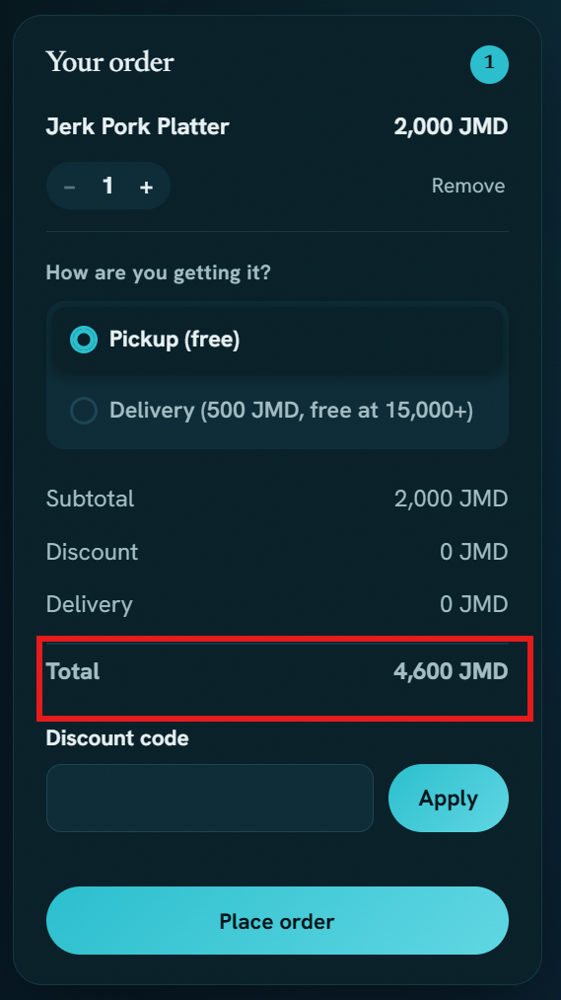

# BUG-002 · Bug Report

## Cart total does not update after removing a dish

**Severity:** Major  ·  **Priority:** P1: Urgent
**Reproducibility:** Always
**Component:** cart
**Environment:** Chrome Version 151.0.7922.71 · Windows 11 · /practice/tumble-kitchen/

### Preconditions
User is on the food ordering application and has access to the cart functionality.

### Steps to reproduce
1. Navigate to the food ordering application at /practice/tumble-kitchen/
2. Add one dish to the cart
3. Add a separate dish to the cart
4. Open the cart and note the current total
5. Click **Remove** on either dish

### Expected result
The removed dish should be deducted from the cart total immediately, and the displayed total should reflect the remaining item(s) in the cart.

### Actual result
The removed dish is removed from the cart, but the cart total does not update and remains at the previous amount.

### Evidence

### Regression
Not sure

### Workaround
Refreshing the page updates the cart total correctly, but this is not a user-friendly solution.

### User impact
Affects all shoppers who remove items from their cart, leading to confusion and potential overpayment.

---

## Summary
This bug report details an issue where the cart total does not update after removing a dish. The removed dish is taken out of the cart, but the displayed total remains unchanged, causing confusion and potential overpayment for the user.